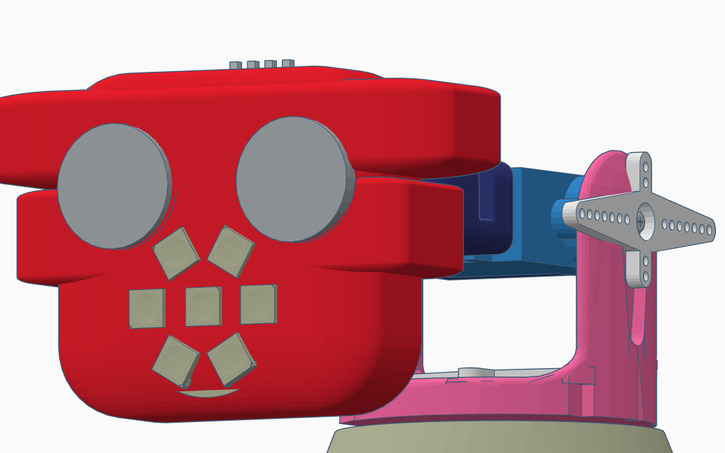

# CharmyBot

Robot que pretende mostrar emociones y ser "Charmy" (encantador)

Inspirado en la idea de ...

## Estructura

Usa como base la famosa [torreta de "ElTitoManolo" ](https://www.thingiverse.com/thing:2467743)

Diseño en progreso en [Tinkercad](https://www.tinkercad.com/things/hTRtqqWvilr)

## Electrónica

Un ESP32 controla:
* 3 servos que lo mueven
* 1 sensor de ultrasonidos que detecta si hay algo cerca creando un mapa
* Un anillo de 7 neopixels que puede expresar "emociones" o "estados" 
* Un altavoz para que reproduzca sonidos

## Programación

Escrito en micropython
* Servidor web accesible
* Controlable
* Actualizable
 
